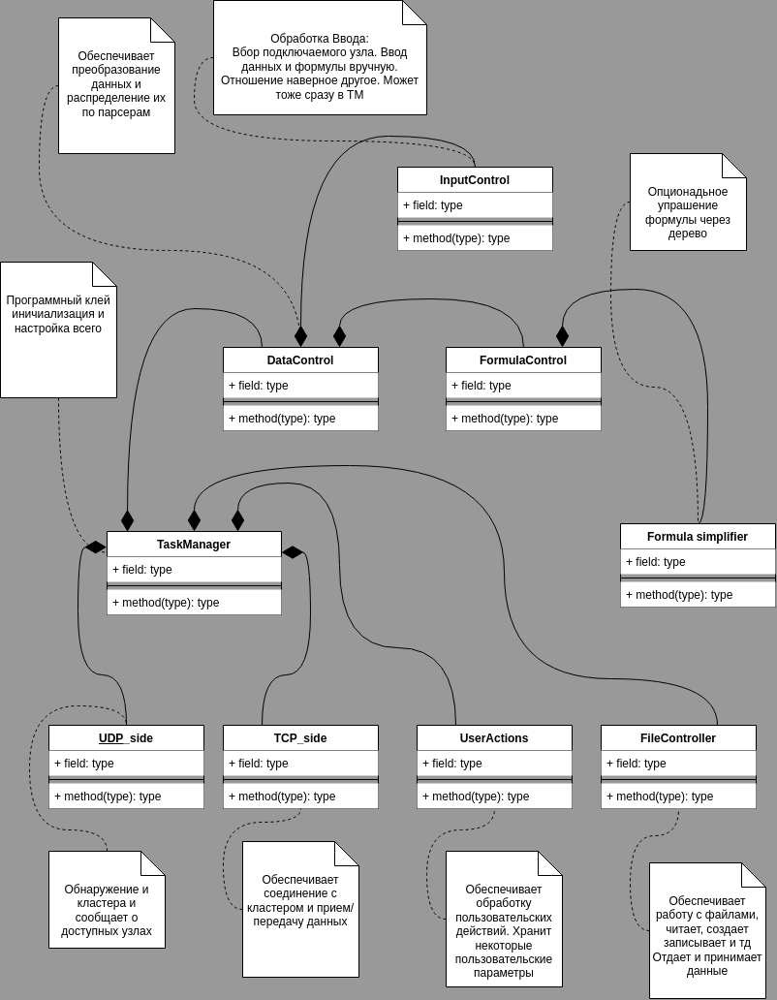

Некоторый набросок архитектуры постановщика.
Базовая идея такая - у нас есть некий объект-клей TaskManager, включающий в себя функционально-самостоятельные узлы: TCP-сеть, UDP-сеть, Парсеры данных, Работы с файлам и Работу с вводом. Верзний класс обеспечивает передачу данных в нужной последовательности между узлами.

