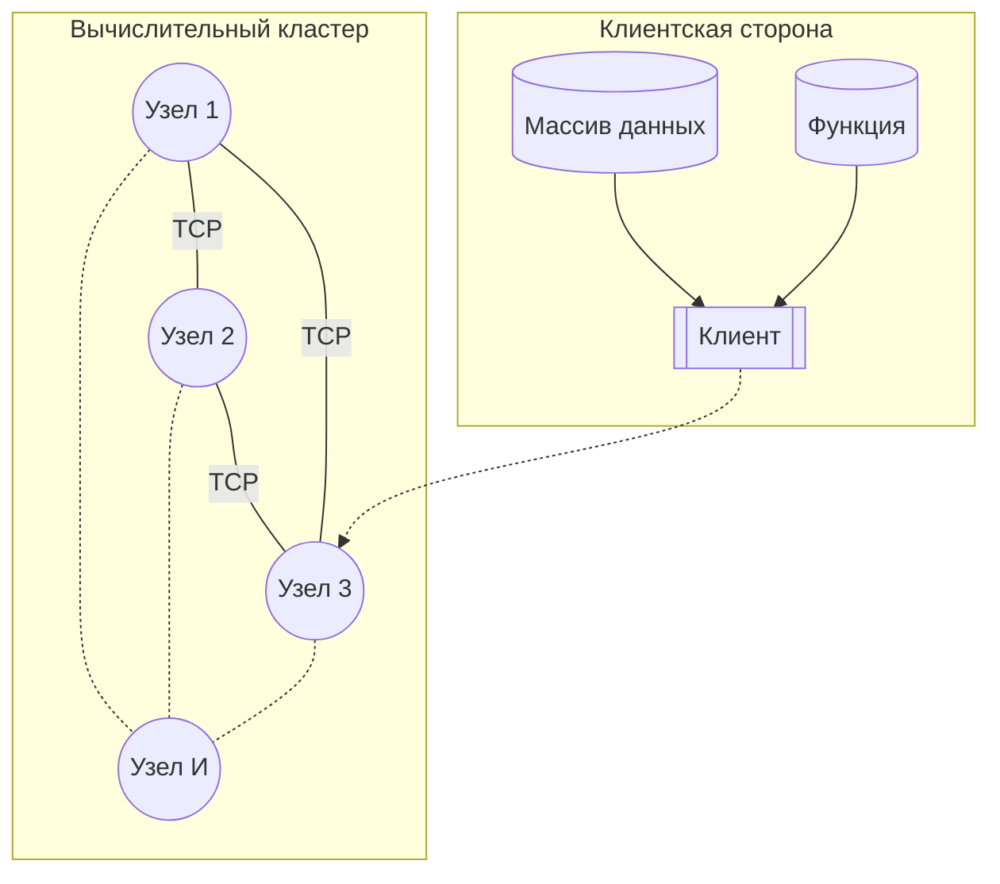
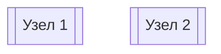
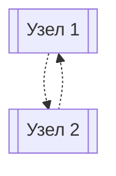
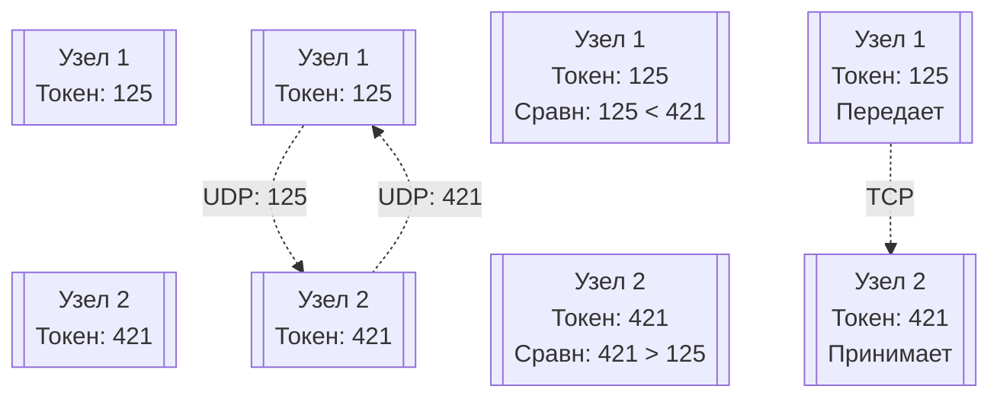

# Дедлайны

21 апреля 2024 (воскр), вечер - сдача технического задания
24 апреля 2024 (среда) - прототип
~ 15-16 мая 2024 - представление проектов

# Структура проекта
## Лор
Заказчик разбил огромную задачу на целый ряд кусков. Один кусок огромной задачи хотят, чтобы реализовали мы. У всех 4-х команды одинаковая задача.
## Описание

### Общий ход выполнения программы

Необходимо написать систему распределенных вычислений, состоящую из двух приложений: узла (worker, вычислитель) и клиента (задатчик). Имеется огромный *массив данных* (несколько миллиардов значений). Также имеется некоторая *функция*. В вычислительный кластер передается массив данных и функция, которое необходимо на эти данные подействовать

Система состоит из:
1) Вычислителей (узлов). Все они умеют выполнять одну и ту же задачу (по сути это одна и та же программа). Они соединены "каждый с каждым" по протоколу TCP.
2) Клиент (задатчик). Может подключиться к любому узлу из кластера. IP узла известен. Клиент отправляет массив данных и функцию выбранному узлу. Затем происходит MapReduce: узел распределяет данные по другим узлам с приоритетом по скорости (мощность машины + пропускная способность сети). На каждом узле происходят вычисления, а затем отправляются обратно выбранному узлу. Выбранный узел передает данные клиенту. Клиент завершает работу.

И узлы, и клиент находятся в одной локальной сети.

## Технические требования

### Как писать
1) Основной фреймворк для написания Qt;
2) Интерфейса командной строки достаточно. Можно писать без QML (даже лучше без него);
3) Формат входных и выходных данных на наше усмотрение. На вход вполне себе может быть текстовый файл с числами в столбик (чтобы можно было руками посмотреть, что там). Можно использовать stdin и stdout и запускать программу в зависимости уже от наших хотелок: подавать на вход файл или вводить что-то в консоль.
4) На узлах может стоят разные операционные системы (кросс-платформенность)
5) Распараллеливать вычисления на узлах не обязательно **(а может стоит??? боремся за скорость; может там какие-то подвохи?)**
6) Вся система (узлы + клиент) находятся в одной локальной сети

### Требования к данным и функции

1) Функция принимает один аргумент $f(x)$;
2) Функция может содержать в любой комбинации: плюс, минус, умножить, делить(?), возведение в степень , тригонометрический функции (синус, косинус, тангенс, котангенс). Арк-функции не нужны. Не требуется реализовывать логарифмы и экспоненты (можно, но не требуется)
3) Данные представляют из себя набор чисел с плавающей точкой (можно double);
4) Корректность массива данных и функции проверять не требуется;
5) Данные можно не шифровать: считаем, что наша локальная сеть - крепость;
6) Данные можно сжимать или не сжимать (зависит от того, что эффективнее: потратить время на сжатие файлов для отправки через узкий канал или тратить время на сжатия нет смысла, быстрее отправить "как есть")

### Поведение программы
1) Узлы должны сами находить друг друга в локальной сети (дискавери-сервис);
2) Узлы могут быть запущены как на отдельных машинах, так и как несколько процессов на одной машине
3) Если по какой-то причине коннект пропадает, то мы пытаемся его восстановить. В процессе вычислений система стабильна. Пока процесс вычислений не идет, система может переконфигурироваться;
4) Задатчик отдает задачу на обсчет, ждет выполненную задачу, а после получения выключается;
5) Пока считаем, что в процессе выполнения задатчики могут подключаться только к избранному узлу. **СТОИТ УТОЧНИТЬ?**
6) Считаем, что мы можем создать достаточно большое количество узлов на одной машине. Проблема портов лежит на плечах сисадмина

### Отчетность

1) Делаем ТЗ на Markdown
2) Предоставляем доступ к исходникам через github.

### Машины
1) Может быть запущено несколько разных не относящихся к делу процессов.
2) Машины в кластере могут иметь разные операционные системы.
3) Машины имеют бесконечно количество памяти

## Черновой вариант архитектуры

### Парсер данных
#### Массив данных
Необходимо перевести данные из файла/консоли в текстовый формат **(что добавить?)**

#### Функция
Клиент передает узлу функцию. В свою очередь, как конкретно она должна передаваться в узел, наша головная боль. Вариант:
1) Использовать скриптовый язык (Python, JavaScript, Lua). Можно впихнуть их в плюсы - **слишком медленно, но быстро пишется**
2) Написать парсер для виртуальной машины (см Вычислительное ядро) - **скорее всего???**
Поскольку парсер является фундаментальной составляющей программы, то принято решение написать собственный парсер. Формат ввода функции задается разработчиками. Можно использовать [польскую запись](https://ru.wikipedia.org/wiki/%D0%9F%D0%BE%D0%BB%D1%8C%D1%81%D0%BA%D0%B0%D1%8F_%D0%B7%D0%B0%D0%BF%D0%B8%D1%81%D1%8C) (рекомендация от Антона).

### Сеть
Здесь необходимо обрабатывать топологию: 
1) устанавливать соединение между узлами, 
2) обрабатывать появление нового узла
3) обрабатывать разрыв соединения (выключение имеющегося узла)

Также нужно определить что быстрее: отправить данные "как есть" по толстому каналу или лучше сжать данные, чтобы отправить меньше данных по медленному каналу. Также должен быть приоритет выбора узла: слабому узлу отправляем мало данных, сильному узлу отправляем много данных. (см Функция измерения производительности узла)

Например, сильный вычислительный узел при слабом коннекте бесполезен 
### Дискавери-сервис
Данный сервис ищет в сети другие узлы. Он нужен для того, чтобы автоматически все другие узлы подключались друг к другу.

Лучше реализовывать, используя протокол UDP! Крайне рекомендовал Антон. Ибо всё, что нам нужно узнать, есть ли кто-то - не более.
#### Коллизия 
##### Проблема
Допустим, что мы одновременно запустили два узла.

С помощью дискавери-сервиса узлы одновременно начали искать "своих" в локальной сети. Это занимает какое-то время. Они находят друг друга. Поскольку они оба "искали, к кому присоединиться", то они оба будут пытаться присоединиться друг к другу

Происходит *коллизия*: узлы пытаются одновременно установить друг с другом соединение.

##### Решение
Чтобы предотвратить такую ситуацию, можно:
1) Использовать таймауты - *неоправданно большие затраты времени на установление связи*
2) Использовать случайные токены - у кого больше, тот и принимает

### Сериализатор
Можно использовать уже готовый, например qtclass - QDataStream.

Рекомендация: сериализатор сделать отдельным классом, чтобы не страдать от того, что он размазан по программе. Его будет проще переписывать

### Вычислительное ядро
На скриптовом языке это будет самое простое, но тогда бы это не имело смысла, ибо это было бы долго. 
Можно написать собственную виртуальZную машину. Погуглить: реализацию ВМ для стрелки Пирса - полезно посмотреть на реализацию. Если сделать собственную узкозаточенную ВМ, то можно будет взять объем данных, забинарить его в виртуалку, отправить и там его фигачить. 
Можно и свой интерпретатор написать.

Нужно сделать так, как будет казаться быстрее.
### Класс MapReduce
(Менеджер распределенных тразакций, что-то типа того)
Он будет разбивать на несколько задач. Он будет знать, сколько узлов в кластере. Будет решать кому отправлять и сколько отправлять. Он должен потом склеить данные в изначальном порядке и отправить данные обратно клиенту

### Функция измерения производительности узла
Эта функция нужна, чтобы понять, как распределить данные между узлами кластера, чтобы производительность была максимальной. 
Про свою вычислительную мощность машина может сказать сама, а вот пропускную способность можно узнать только в случае, если мы отправим тестовый пакет на передачу *со стороны того, кто будет получать данные*. Скорость между узлами может быть различной, а инфа нам должна прилетать на какой-то конкретный.

В линуксе можно использовать CPU-info, там будет количество операций в секунду. В винде может тоже можно, черт его знает.

## Тестирование

Наш проект должен иметь
1) Unit-тесты
2) Интеграционные тесты
3) Ручные тесты

#### Ручное тестирование
Это тест-план: я иду сюда, беру это, подаю на вход это и должен получить такой-то результат

#### Интеграционные тесты
Они будут тестировать классы, на которые мы разобьем программу и отдельно их будем реализовывать. Делается это с помощью моков
Пишем моки, пишем тест, который будет его использовать, и всё норм
```
Моки - это "фейк-объект", который делает вид, что он настоящий. Если мы тестируем, например, соединение с БД или соединение через TCP-IP мок будет делать вид, что он БД.
```
## Техническое задание

В ТЗ должно быть:
1) Топология системы **(Может имелась ввиду архитектура? Он сказал "топология" а дальше начал говорить про архитектуру - и всё под пунктом 1)**
2) Описание процедуры работы системы
3) Формат входных и выходных данных
4) Базовые сценарии тестирования 

После того, как мы напишем ТЗ, нам нужно будет описать архитектуру системы. Чтобы эффективно распараллелить работу между нами, нужно задачу декомпозировать. Для этого нужна архитектура и прописанные интерфейсы между кусками системы.

Декомпозировать задачу могут помочь UML. Это язык для описания сетевых интерфейсов. Это универсальный язык для описания всяких структур, типа классов, взаимодействия узлов и т.д.

На этапе разработки архитектуры нужно будет начерно написать хедеры для всего этого: какой класс что будет выполнять, как он будет взаимодействовать с другими классами. Как только поймем, сколько классов в системе, уже поймем, что кому делать.