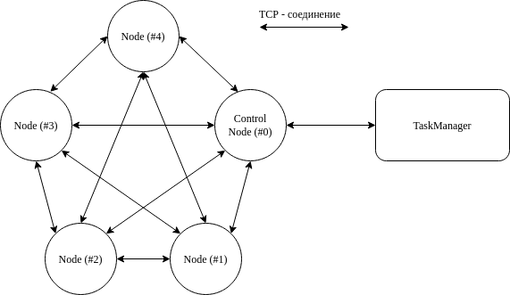

## Техническое задание
### Разработка системы распределённых вычислений. 
Рассматриваемая ниже система может состоять из N узлов (далее именуемых Node). Для управления системой используется внешний и постановщик задачи (далее именуемый TaskManager). Node системы получивший соединение от TaskManager становится управляющим (ControlNode) и дополнительно выполняет распределение задачи остальным node и сбор результатов.
### Топология системы
**Полносвязная топология (полный граф)** — топология компьютерной сети, в которой каждая рабочая станция подключена ко всем остальным. Этот вариант является логически простым. Для каждой пары должно быть создано соединение.

#### Преимущества
- Имеется прямой канал до каждого узла в сети;
- Отказоустойчивость.

#### Недостатки
- Сложное расширение сети (при добавлении одного узла необходимо соединить его со всеми остальными);
- Огромное количество соединений при большом количестве узлов.

### Описание процедуры работы системы
**Вычислительный кластер:**
- Кластер состоит из N Node. (N >= 1)
- Каждый запущенный экземпляр приложения - отдельный узел.
- При запуске приложение формирует и хранит случайное число (приоритет).
- Приложение собирает и сохраняет информацию о вычислительной мощности узлов.*  
- Каждый запущенный экземпляр приложения по протоколу UDP отправляет широковещательный пакет (ID_CONNECT) с идентификатором для установления соединения каждый с каждым по протоколу TCP.
- UDP пакет содержит IP адрес отправителя, порт сервера для подключения, номер приоритета и вычислительную мощность.
- При получении UDP пакета приложение формирует список доступных узлов для установления соединения. Подключаемый узел ожидает дополнительную информацию об узлею
- После подключения узла по протоколу TCP, подключаемый узел высылает номер приоритета, дублирует информацию, высылаемую по UDP, для получения информации об узле.
- Соединение устанавливает то приложение у которого ниже приоритет. Для локального варианта соединение устанавливает приложение с меньшим номером порта.
- В результате каждое приложение содержит таблицу: IP узлов кластера, порт, приоритет, вычислительная мощность узла.
- Получив размер входных данных от TaskManager, узел с учётом метрики (учитывается вычислительная мощность и пропускная способность сети) составляется план по разбиению данных по узлам.** Если данных меньше чем узлов, вычислительная нагрузка ложится на узлы с более производительной метрикой. 
- Получив пакеты от TaskManager, узел распределяет их по вычислительному кластеру в соответствии с подготовленным планом.
- После завершения вычислений данные отправляются обратно узлу от которого они были получены, а он их отправляет в TaskManager.
- Допускается ситуация, при которой Node выполнит всю задачу сам

*В качестве оценки производительности взято время в наносекундах, затрачиваемое узлон на обсчёт формулы из 72 действий (с использованием всех возможных в кластере рвномерно) для 10'000'000 случайных значений.
**Оценка зависимости объёма эффективно обрабатываемых данных от скорости соединения и вычислительной мощности узла должна быть определена на этапе разработки. 

**TaskManager**
- Может поключиться к любому известному узлу кластера до начала обработки задачи.
- TaskManager имеет доступ к массиву данных и математической функции (задаётся в обратной польской нотации, используемые операции +, -, /, \*, sin, cos, tan, ctan).
- При запуске TaskManager в качестве параметра необходимо передать IP адрес узла к которому хотим подключиться (опция -n, node), имя файла (путь до файла) где лежат данные (опция -i, input), имя файла (путь до файла) где будет сохранен результат вычисления (опция -o, output). Если имя выходного файла не задано результат вычисления будет выводится в файл results.txt в директории с исполняемым файлом TaskManager.
- На стороне TaskManager выполняется разбор функции (обратная польская нотация) и формируется математическое выражение.
- После подключения TaskManager передаёт узлу размер обрабатываемых данных, математическую функцию и пакеты содержащие данные с учётом их расположения в исходном файле.
- Полученные результаты вычислений собираются в выходной массив данных, сохраняются в файле на стороне TaskManager.
.

### Формат входных и выходных данных
Файл начинается со строки "formula"
Входные данные для вычислительного кластера представляют собой текстовый файл. Данный файл содержит числовые значения записанные в один столбец. Функция применяемая к данным хранится в текстовом файле и представляет собой математическую формулу записанную в обратной польской нотации. Приняты следующие обозначения:
- "+" (сложить два числа)
- "-" (вычесть два числа)
- "*" (умножить два числа)
- "/" (разделить два числа)
- "S" (синус от одного числа)
- "C" (косинус от одного числа)
- "T" (тангенс от одного числа)
- "Y" (котангенс от одного числа)
- "X" (элемент массива на обработку)
- Также в формуле могут быть обычные числа, которые воспринимаются, как константы

Выходные данные записываются в отдельный файл в той же последовательности как они были записаны во входном файле.

### Базовые сценарии тестирования
Покрытие системы unit-тестами, валидация желаемой работы каждого класса
Подготовка moc-объектов для проверки работоспособности отдельных подсистем - сеть, рапределение задач, вычисление, общение с пользователем

Проверка готовой системы на следующих сценариях работы:
Проверяем следующие критерии системы:  
1. Масштабируемость. Проверяем построением вычислительного кластера с разным количеством узлов. Создаем кластеры с одним узлом, с количесвом узлов равным количеству ядер тестовой машины, кластер на нескольких машинах.  
1.1. Проверяем отработку выключения узлов до начала выполнения задачи
2. Выполнение математических функций. Проверку математических функции разбиваем на два этапа. На первом этапе выполняем проверка каждой математической операции отдельно (+, -, /, *, sin, cos, tan, ctan) на элементарной последовательности чтобы можно было глазами проверить правильность выполнения.  
На втором этапе задаем математические выражения в разных сочетаниях.  
3. Распределение вычислительной нагрузки. Проверка распределения вычислительной нагрузки проверяется изменением метрики (уменьшаем/увеличиваем вычислительную мощность узлов, уменьшаем/увеличиваем пропускную способность соединений).  
